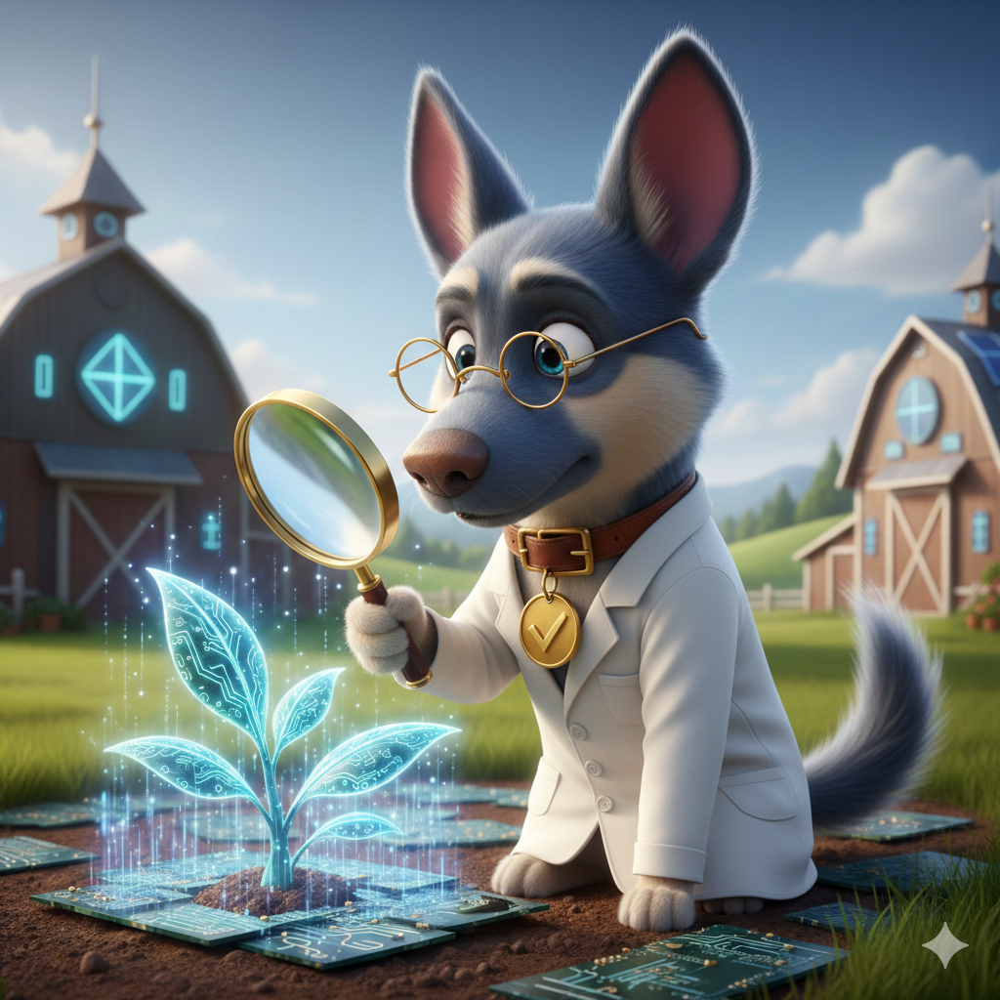
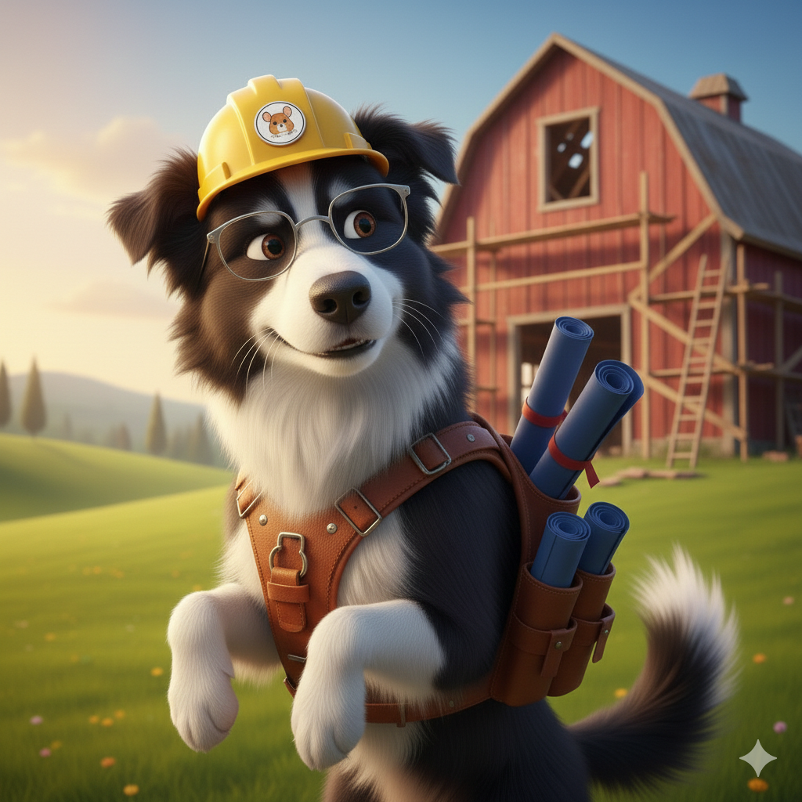

# 🐾 Gingilla Farm

Welcome to the heart of the farm. This ecosystem is managed by **Gingilla**, the ginger chinchilla, ensuring every service and script works in perfect harmony.

---


## 🌾 The Story of the Farm
Welcome to **Gingilla Farm**. This is not just a server farm; it is a living ecosystem where every line of code is a seed planted, and every container is a sturdy structure in the field.

In our farm, many inhabitants (scripts and services) live and work together in harmony. Some guard the fences, some process data in the fields, and others build new tools for the community. Gingilla, the ginger chinchilla who leads the farm, ensures everything runs with order, technological efficiency, and full transparency.

---

## 👥 Meet the Inhabitants

### 🐕 The WatchDogs

> *The vigilant guardians of the farm, these admin scripts handle the "dirty work" of logging, health checks, and system integrity etc.*

| Name | Character                                                                                  | Duty | Catchphrase | Link                                               |
|------|--------------------------------------------------------------------------------------------|------|-------------|----------------------------------------------------|
| **LogDog** | <!-- OR --> <br>           | Sniffs out every API call and system error across Python and Node.js. | "A sharp bark for every spark." | [View Documentation](./watchDogs/logDog/README.md) |
| **HealthDog** | <!-- OR --> <br>     | Checks database heartbeats and service availability every morning. | "A farm is only as strong as its fences." | [View Documentation](./watchDogs//healthDog/README.md)        |
| **BlueprintDog** | <!-- OR --> <br>  | Builds new services and inspects structures for Docker and Lore compliance. | "Measure twice, bark once." | [View Documentation](./watchDogs//blueprintDog/README.md)     |

### 🏗️ The Buildings
> *ore services and microservices.*
* **Infrastructure:** The foundation of the farm. 
  * **[TBD]**
* **Apps:** Specialized services.
* * **[TBD]**

---
## 🗺️ Navigate Map (Structure)

```text
GingillaFarm/
├── .env.example             # Central configuration
├── docker-compose.yml       # The Farm's infrastructure blueprint
├── README.md                # Main Farm documentation
└── watchDogs/               # Admin scripts handle the "dirty work"
```
---

## ⚖️ Core Rules
> *To keep the farm flourishing, every new inhabitant or building must follow these rules:*

1.  **Deployment:** Everything must be containerized using **Docker** and **docker-compose**.
2.  **Localization (i18n):** Frontends must support an **English/Hebrew** toggle with full **RTL/LTR** support.
3.  **Security:** Sensitive data must stay in a centralized `.env` file. **Never** hardcode secrets.
4.  **Code Style:** Code remains professional and clean. The "Farm Lore" exists **only** in README files.

---

## 🚜 Quick Start


> *Follow these steps to set up the Gingilla Farm environment and deploy the first WatchDogs.*


## 1️⃣ Prepare the Soil (Environment)

Clone the repository and initialize your central configuration.

```bash
git clone https://github.com/your-username/GingillaFarm.git
cd GingillaFarm
cp .env.example .env
```

**Important:**  
Edit the `.env` file and set `FARM_ROOT_PATH` to your current directory path to ensure logs are stored correctly.

---

## 2️⃣ Summon the Hounds (Infrastructure)

Initialize the farm's base layer. This sets up the shared volumes and the initial logging environment.

```bash
docker-compose up -d
```

---

## 3️⃣ Verify the Perimeter

Check that the LogDog is ready to track events across the farm.

```bash
# Ensure the log directory was created
ls ./farm_logs
```

---

# 🛠️ Prerequisites

To run the farm buildings and WatchDogs, you need the following tools installed:

- **Docker & Docker Compose** — The farm's foundation  
- **Python 3.10+** — For Python-based WatchDogs  
- **Node.js 18+** — For JavaScript-based services  

---

*“Stay Fluffy, Code Sharp.”* – **Gingilla** 🐾