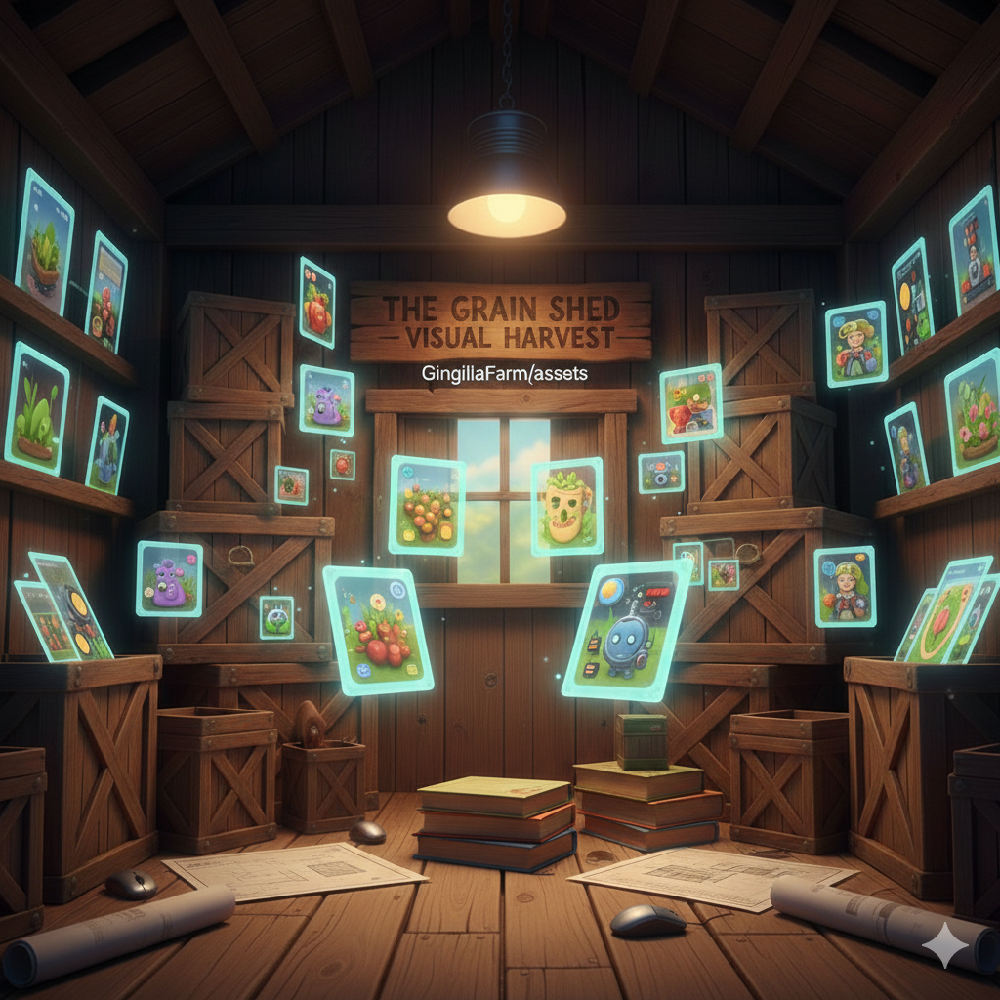

# 🖼️ The Gallery: Assets Silo

> *The visual history and raw materials of Gingilla Farm, where every pixel is a seed of the imagination.*

---

## 🌾 Farm Lore

In the center of **Gingilla Farm** stands the **Silo of Wonders**. This isn't where we store grain or tools, but where we keep the farm's beauty. Every portrait of Gingilla, every blueprint of our buildings, and every icon used in our interfaces is polished and stored here. 

Without the Gallery, the farm would be a cold, grey place of just code. Here, the "Farm Lore" comes to life through color and shape, ensuring that while our work is professional, our spirit remains "fluffy."

---

## 🛠️ Technical Overview

This directory serves as the **Central Asset Repository** for the entire GitHub ecosystem. To maintain the "Disney/Pixar 3D style" mentioned in the Core Rules, all generated images must be vetted before being placed in the main folders.

### Directory Structure

- `/watchdogs/`: Portraits and character art for our admin scripts.
- `/branding/`: Logos, Gingilla character renders, and color palettes.
- `/ui/`: Icons and assets for the Vite/Tailwind frontends.

---

## ⚖️ Asset Rules

1. **Consistent Style:** All project images must follow a **Disney/Pixar 3D style**.
2. **Format:** Prefer `.png` for transparency and `.webp` for web performance.
3. **Naming:** Use `kebab-case` (e.g., `blueprint-dog-render.png`). No Hebrew in filenames.