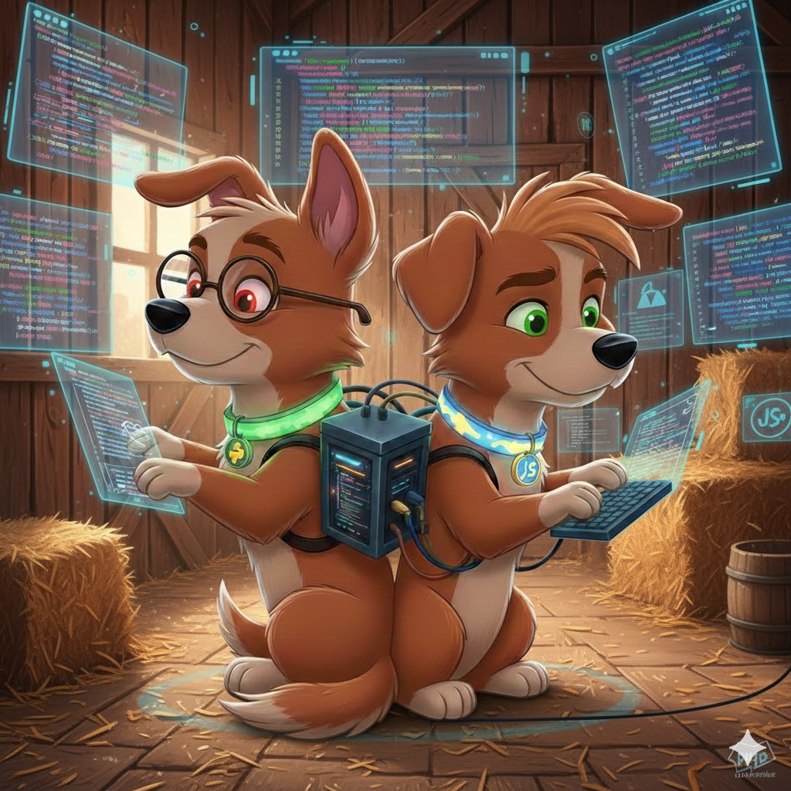

# 🐕 WatchDog: LogDog



> *The loyal hounds of Gingilla Farm, ensuring no event goes unnoticed and every trail is tracked.*

---

## 🌾 Farm Lore

In the bustling ecosystem of **Gingilla Farm**, information flows like water in the irrigation pipes. To keep the farm running smoothly, Gingilla has recruited the **LogDogs**. These sharp-eyed hounds sit at the entrance of every building (service), sniffing out every activity—from a simple gate opening (API GET) to a critical fence breach (Security Error).

The LogDogs speak two languages: **Python** and **JavaScript**, allowing them to communicate across the entire farm while maintaining the exact same reporting format. They store their findings in a shared **Log Kennel** (Volume), where Gingilla can review the farm's history at any time.

---

## 🛠️ Technical Overview

LogDog is a cross-platform logging utility designed to standardize logs across the Gingilla Farm ecosystem. It provides unified, color-coded console output and daily rotating file logs.

### Features

- **Unified Formatting:** Identical log structure (TraceID, Context, Project) for both Python and Node.js.
- **Intelligent UI:** Automatic truncation for long messages and project names to keep the terminal clean.
- **Persistence:** Built-in support for daily file rotation with a 14-day retention policy.
- **Docker-Ready:** Designed to write to a shared volume path defined by `FARM_ROOT_PATH`.

---

## 📂 Project Structure

```text
logDog/
├── python/
│   ├── log_dog.py
│   └── requirements.txt
└── nodejs/
    ├── log_dog.js
    └── package.json
```

---

# 🚀 Installation & Usage

## 🐍 Python Side

### Requirements

- python-dotenv

### Install

```bash
pip install -r python/requirements.txt
```

### Usage

```python
from log_dog import setup_log_dog

dog = setup_log_dog("BuildingName")
dog.info("User logged in", extra={'traceID': 'req-101', 'context': 'Auth'})
```

## 🟢 Node.js Side

### Requirements

- winston
- winston-daily-rotate-file
- dotenv

### Install

```bash
npm install
```

### Usage

```javascript
const setupLogDog = require('./log_dog');

const dog = setupLogDog("BuildingName");
dog.info("User logged in", { traceID: 'req-101', context: 'Auth' });
```

---

# 🐳 Containerization (The Log Kennel)

To ensure all LogDogs write to the same location, you must mount the shared log folder in your `docker-compose.yml`.

## Shared Volume Configuration

```yaml
services:
  your-app:
    # ... other config ...
    volumes:
      # Map the host's log folder to the container's kennel
      - ${FARM_ROOT_PATH}/farm_logs:/app/farm_logs
    environment:
      - FARM_ROOT_PATH=/app
```

---

# ⚖️ Core Rules Compliance

- Everything is Containerized – Ready for Docker volume mounting
- Centralized Secrets – Reads `FARM_ROOT_PATH` from the central `.env`
- Language-Specific Best Practices – Uses standard logging for Python and winston for Node.js
- Professional Code – Clean implementation with English-only comments

---

> “A sharp bark for every spark.” – The LogDogs 🐕